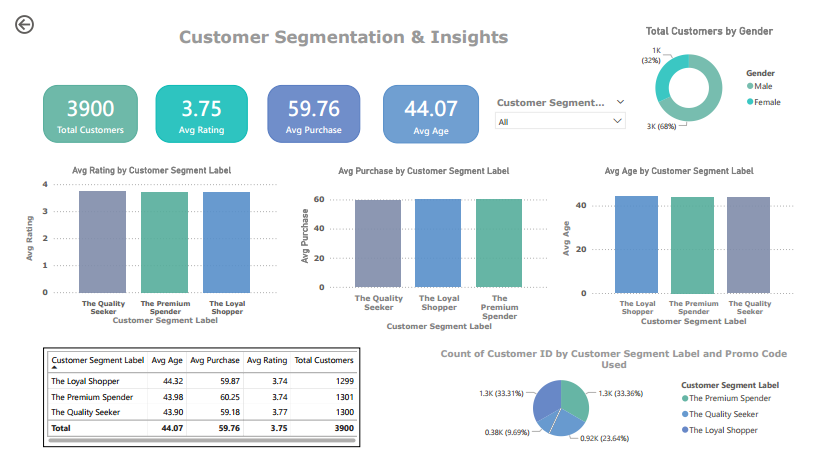

# 🛍️ Customer Segmentation using Clustering

This project focuses on segmenting customers based on their purchasing behavior using clustering techniques. The goal is to help businesses better understand their customer base and implement more targeted marketing strategies.

---

## 🎯 Project Objectives

- Segment 3,900 customers based on demographic and transactional behavior.
- Provide an **interactive Power BI dashboard** for visual exploration.
- Deliver business insights to support data-driven decisions.

---

## 🧪 Methodology

1. **Data Preprocessing**
   - Removed irrelevant columns
   - Normalized numerical features
   - Encoded categorical variables

2. **Clustering**
   - Models used: `KMeans`, `Agglomerative Clustering`, `Gaussian Mixture Model (GMM)`
   - Evaluation metrics:
     - Silhouette Score: KMeans (0.5896) — best
     - Davies-Bouldin Index: KMeans (0.5002) — best
   - PCA 2D visualization for cluster distribution

3. **Customer Segmentation**
   - Cluster 0: *The Loyal Shopper*
   - Cluster 1: *The Premium Spender*
   - Cluster 2: *The Quality Seeker*

---

## 📊 Clustering Result (3,900 Customers)

| Customer Segment       | Avg Age | Avg Purchase | Avg Rating | Total Customers |
|------------------------|---------|--------------|------------|-----------------|
| The Loyal Shopper      | 44.32   | 59.87        | 3.74       | 1299            |
| The Premium Spender    | 43.98   | 60.25        | 3.74       | 1301            |
| The Quality Seeker     | 43.90   | 59.18        | 3.78       | 1300            |
| **Overall Average**    | **44.07**   | **59.76**    | **3.75**   | **3900**        |

---

## 📊 Interactive Dashboard (Power BI)

The dashboard presents intuitive and interactive visualizations, including:

- **Total Customers & Gender Breakdown**
- **Average Rating, Purchases, and Age by Segment**
- **Customer Distribution by Segment & Promo Code Usage**
- Dynamic filtering by customer segment

## 📊 Dashboard Preview

> *Note: Open the `.pbix` file in Power BI for full interactivity.*

---

## 🛠 Tools & Libraries Used

## 🧠 Strategic Insights

- **The Premium Spender** group has the highest average purchase → ideal for loyalty and upselling programs.
- **The Quality Seeker** segment gives the best product ratings → can be leveraged as brand advocates.
- **The Loyal Shopper** group is consistent and dependable → keep them engaged with regular promotions.

---

## 📬 Contact

Created by: Wilma Nur Fatimah  
Email: nurfatimahwilma@gmail.com  
LinkedIn: www.linkedin.com/in/wilma-nur-fatimah-9860332bb

